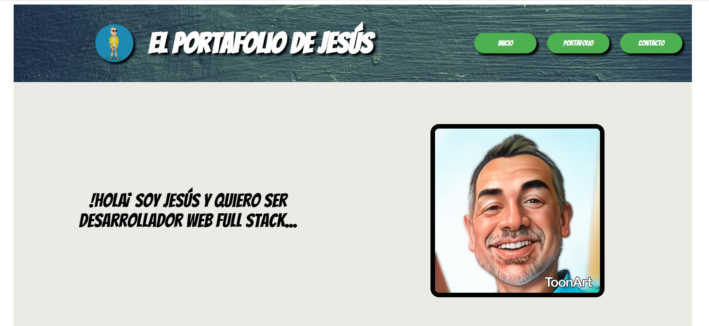

### Bootcamp Full Stack developer - Upgrade Hub
## Proyecto HTML y CSS
---

Página Web creada utilizando HTML5 y SCSS (CSS) como proyecto del primer módulo del bootcamp.

La idea es crear una web donde se presenta el portafolio de trabajados realizados como desarrollador.

* Visitar la web, disponible en:
[https://jesusleal.netlify.app/](https://jesusleal.netlify.app/)

* Todo el código fuente está disponible en el repositorio:
[https://github.com/portfolio-jesus-leal/proyecto-html-css-jesus-leal](https://github.com/portfolio-jesus-leal/proyecto-html-css-jesus-leal)

...

**Estructura:**

Componentes creados:
- index.html
- pages/contact.html
- pages/portfolio.html
- styles/styles.scss
- styles/style.css (Generado a partir de styles.scss)
